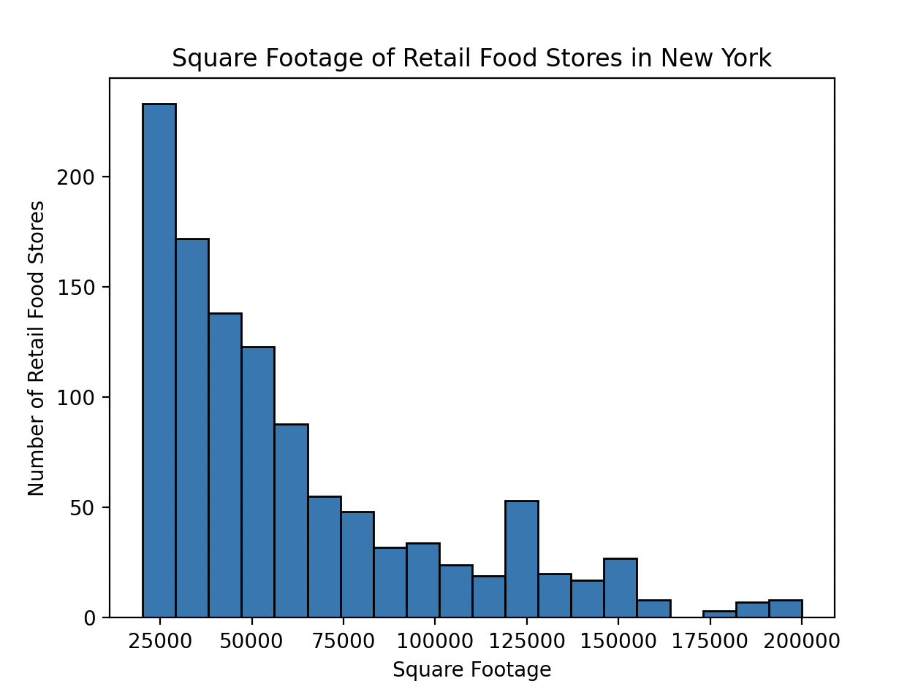
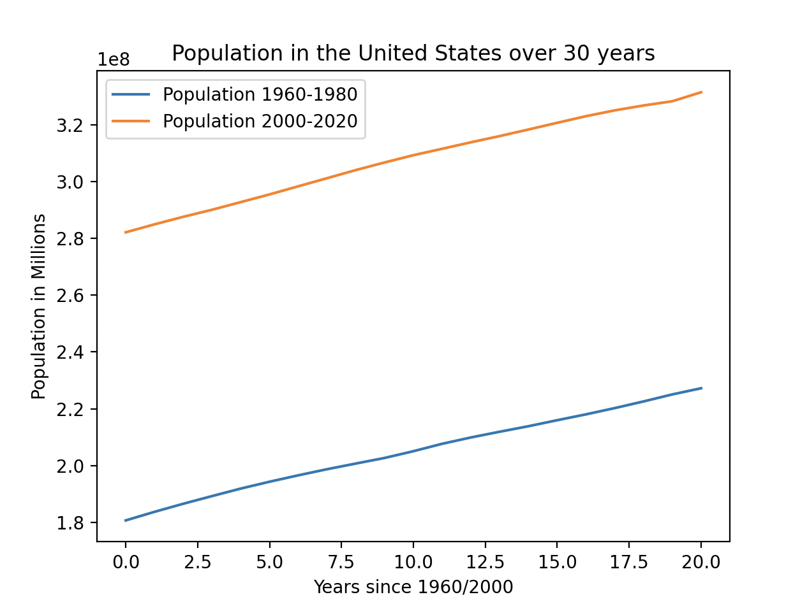

# Project 2: Data Visualization [Github](https://github.com/mikeizbicki/cmc-csci040/tree/2022fall/project_02)
## Graph 1: New York - Square Footage of Retail Food Stores

This is a histogram representing the number of retail food stores and their corresponding square footage in New York. I only included stores that had a square footage between 25,000 ft^2 and 200,000 ft^2 because those are the most prevalent for retail food stores. I received this data from Data.Gov, which you can find [here](https://catalog.data.gov/dataset/retail-food-stores).

## Graph 2: Population in Millions in the United States from 1960-2019

This graph shows the population in the United States over 30 years from 1960 to 2019. To prevent a long x-axis, I divided the graph into two different lines – one showing the population from 1960-1989, and one showing the population from 1990-2019. I was able to find this dataset under [github](https://github.com/jdorfman/awesome-json-datasets#population), [this](http://api.worldbank.org/v2/countries/CHN/indicators/SP.POP.TOTL?per_page=5000&format=json) is the link to the dataset.