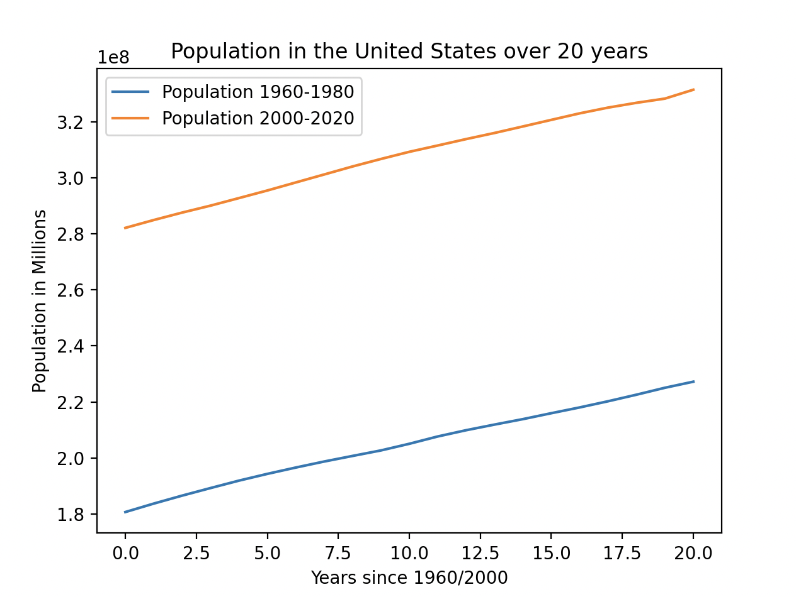

# Project 2: Data Visualization [Github](https://github.com/mikeizbicki/cmc-csci040/tree/2022fall/project_02)
## Graph 1: New York - Square Footage of Retail Food Stores

This is a histogram representing the number of retail food stores and their corresponding square footage in New York. I only included stores that had a square footage between 25,000 ft^2 and 200,000 ft^2 because those are the most prevalent for retail food stores. I received this data from Data.Gov, which you can find [here](https://catalog.data.gov/dataset/retail-food-stores).

## Graph 2: Population in Millions in the United States from 1960-1980 and 2000-2020

This graph compares the population in the United States from 1960-1980 and 2000-2020. The population in the US grew significantly at a somewhat constant rate throughout 1960-1980 and 2000-2020, so the population at 2000 is significantly greater than the population in 1960. I was able to find this dataset under [github](https://github.com/jdorfman/awesome-json-datasets#population), and [this](http://api.worldbank.org/v2/countries/CHN/indicators/SP.POP.TOTL?per_page=5000&format=json) is the link to the dataset.